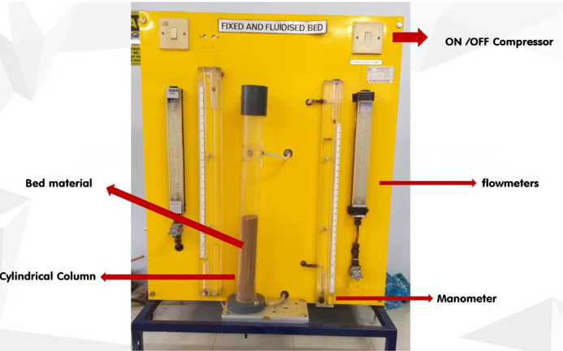
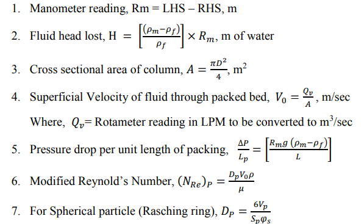
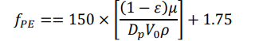

<b>Requirements (Instruments, Chemicals & Other) : </b> 
The experimental setup consists of a vertical cylindrical pipe/column of a known diameter and filled with a Raschig Rings. The packing is supported on a stainless screen mesh held between the two bottom flanges. Another wire mesh provided between the top flanges prevents the solids from being carried over. It has an inlet regulating valve, pressure tapings across the bed, a half horsepower pump is connected to a water pump tank with a bypass pipe to regulate the flow throughout the packed bed and rotameter to measure flowrate. U-tube manometer is connected to the two ends of the column. 

 

<b>Formula used : </b> 
 

Where φs is sphericity and is defined as the surface – volume ratio of the sphere having the same volume as Rasching ring to the surface volume ration of the sphere of the particle. {surface area of the sphere having the same volume as the particle to the surface area of the particle} 
Friction factor for packed bed. (Experimental)  

 

Where porosity, 𝜀 = Volume of voids /Volume of bed Volume of voids =approximately 2.5 liters or 2.5 x 10-3m3 Volume of bed = Cross sectional Area of column (A) × Length of Bed 

<b>Procedure : </b> 
1.	The motor is started and water is pumped into the arrangement. The bypass may be used for better control of flow. 
2.	The rate of flow in the tower can be controlled by a valve in the inlet pipe. 
3.	The inlet valve is maintained in such a way that level of water in manometric tubes are equal. 
4.	The water is allowed to flow through the packing in the tower. All the air pockets in the tower and in the manometer are removed. 
5.	The distance between the pressure taps is noted as height of the tower(L). 
6.	The outlet valve is opened. 
7.	Time taken to collect the water is noted. 
8.	The flow rate is calculated from the volume of water collected.

