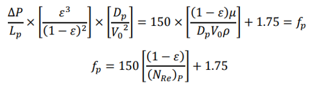

Fluids are forced to flow through stationary beds of particulate or porous solids in a wide range of particle situations including moisture assimilation by soils, adsorption, ion exchange, and many of the examples noted in the introductory section. 

Packed beds are used extensively in absorption, distillation and liquid extraction process where large surface area is necessary to provide intimate contact between two phases – gas-liquid or solid-liquid. As the fluid passes through the bed, it does so through empty spaces (Voids) in the bed. The voids form continuous channels through the bed. These channels need not be of same length and diameter. While the flow may be laminar through some channels, it may be turbulent in other channels. The resistance due to friction per unit length of the bed can be the sum of two terms: 1. Viscous drag force which is proportional to the first power of fluid velocity, V. & 2. Inertial force which is proportional to the square of the fluid velocity, V. Since V, velocity in the channel is difficult to estimate, V is substituted by Vo, the Velocity through the empty cross section of the column. Vo is related to V by the expression Vo = ϵ V where ϵ is the bed void age or porosity. The total surface area of the particles in the bed which come in contact with the fluid is a function of specific surface of the particle and its sphericity and the voids in the bed. Taking all these facts into considerations ERGUNS EQUATION has been derived to estimate the pressure drop for flow of fluid through a packed bed. { For φs = 1}. 

